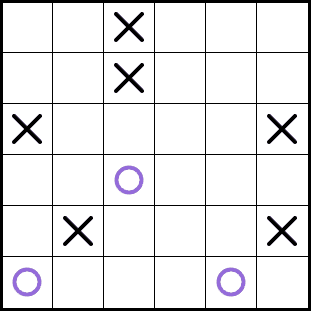

#### Tic-Tac-Logic game website and demo:
https://www.conceptispuzzles.com/index.aspx?uri=puzzle/tic-tac-logic




#### Compile and run the `Main.exe` file with `tic_tac.txt` input:
```txt
6 6
X..O..
..OO.X
.OO..X
......
OO.X..
.X..OO

XOXOXO
OXOOXX
XOOXOX
OXXOXO
OOXXOX
XXOXOO
```

**Completed Requirements:**
- **Main Requirements:**
  - First 4 techniques (Basic Techniques)
  - Brute-force search
- **Additional Requirements:**
  - Basic technique 5
  - Advanced technique 1
  - Advanced technique 2

**Main.hs:**
- Accepts an array of passed strings.
- If the input is valid, it converts it to a grid described in Helpers.hs.
- Each cell of the grid can be X, O, empty E (dot), or unknown N (why, I don’t know).
- The grid is passed to the gridSolvers described in TTL.hs.
- If the gridSolver successfully solves it, it returns the solution.
- Otherwise, it writes that the input was invalid, or no solution exists.

**TTL.hs:**
- **gridSolver** uses techniques (techSolver). If the board is not filled, it places a symbol via brute force.
- **techSolver:**
    - The 5th technique (lineSolver) works only on rows and scans each row.
    - The 2nd technique (avoidDuplication, advancedTech2) needs knowledge of other rows and scans the entire board.
    - These techniques are used as long as the board changes.
    - For columns, `doOnRowsCols` uses the transpose function.
- **bruteForce:**  
    The Boolean argument is used to try X and O sequentially. It attempts to place X first, then O, in the first available cell.  
    If the board is invalid or cannot be filled, it reverts to the previous version and attempts to place the second symbol.

**Solvers.hs:**
- **avoidTriple1:** Uses pattern matching to look for two identical symbols side by side and places the opposite symbol next to them.
- **avoidTriple2:** Uses pattern matching to find two identical symbols one cell apart and places the opposite symbol between them.
- **avoidTriple3:** Through `remainXO`, determines how many X's and O's remain to be placed in the row.  
    The technique is used when there is one X (O) and more than one O (X) to be placed.  
    The symbol that has one remaining is marked by `charToGuess`, and the other symbol by `otherChar`.  
    The function should then spread a combination that is guaranteed to be correct.
    - The combination is the sequence of all possible symbols that can be spread across the row.
    - Example: `spreadOnDot [X,O,O] [O,E,X,E,X,E] == [O,X,X,O,X,O]`
    - `fillVariants` helps determine valid and invalid combinations.
    - If only one valid combination remains, it is placed.
    - If only invalid combinations are available, we try the following:
        - We want to place the opposite symbol (O or X) wherever `charToGuess` cannot be placed.
        - We invert all combinations.
        - If one remaining X (O) cannot be placed in a cell, the opposite symbol (O or X) must be placed instead.
        - We merge invalid inverted combinations and spread them across the row's cells.
- **completeLine:**  
    We ensure that the number of X's and O's must be equal.  
    With `remainXO`, we find how many X's and O's remain to be placed and place the one that is left (if it’s not zero).
- **avoidDuplication:**  
    This technique works across the entire board when there are two cells left to fill in a row.  
    It uses `fillVariants2` to find valid and invalid combinations for spreading.  
    If only one valid combination exists, it spreads it.
- **avoidTech1:**  
    This technique applies when there are only two X's (O) left in a row, and more than one O (X).  
    With `onlyValidSpread`, it determines what must be placed in each cell to avoid triples.  
    Using helpers like `fillVariants`, `listCommons`, and `oneHasOtherNot`, we determine the only possible placement for each empty cell.

- **avoidTech2:**  
    Similar to `avoidDuplication` across the entire board but applies when there is only one remaining symbol.  
    It passes through all rows and columns to change the board as needed.  
    Similar to `avoidTech1`, it uses an updated version of `onlyValidSpread`, which accounts for duplicates.

**Helpers.hs:**
- Each function in the code has a description in the form of a comment.

**Additional Libraries:**
- Only the sort function is used from external libraries.

**The input does not require specifying the number of rows and columns.**

After ensuring accuracy and performance:
- The functions were analyzed individually and checked with examples.
- Solving several complex puzzles in the Conceptis Puzzles application.